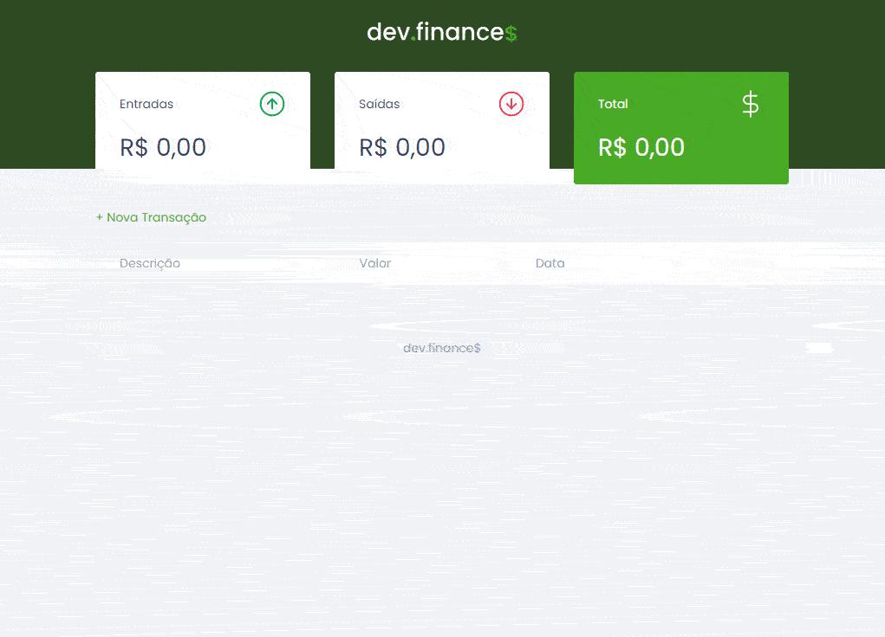

# Maratona Discover - DevFinances

Projeto DevFinances referente à <a href="https://app.rocketseat.com.br/node/maratona-discover-edicao-01">primeira Maratona Discover</a> da <a href="https://rocketseat.com.br/">Rocketseat</a>.

O projeto é um exemplo de aplicação web, onde é possível realizar um controle financeiro, cadastrando suas entradas e saídas e extraindo um saldo geral do seu orçamento pessoal. Para a sua realização, foi utilizado o HTML, CSS e JavaScript.

Me siga no <a href="https://www.linkedin.com/in/jose-de-souza/">Linkedin</a>